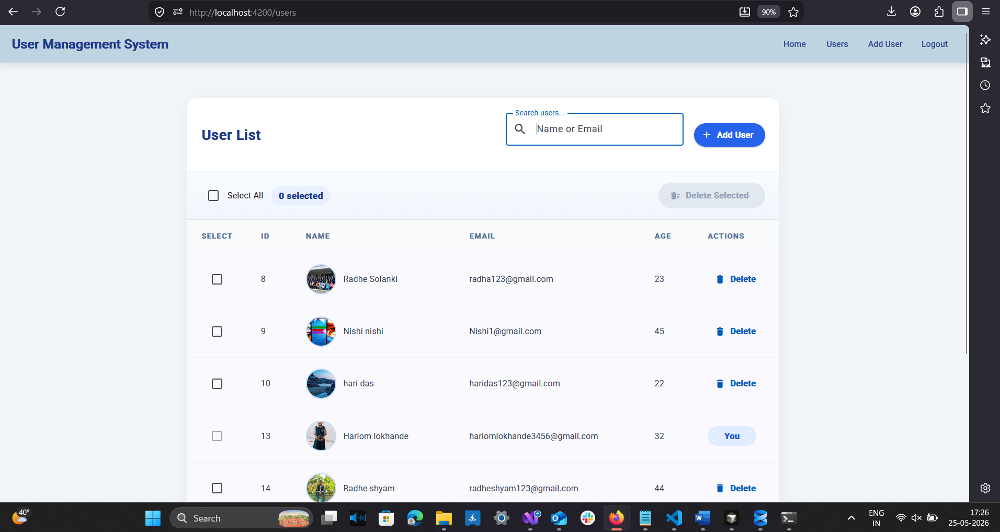
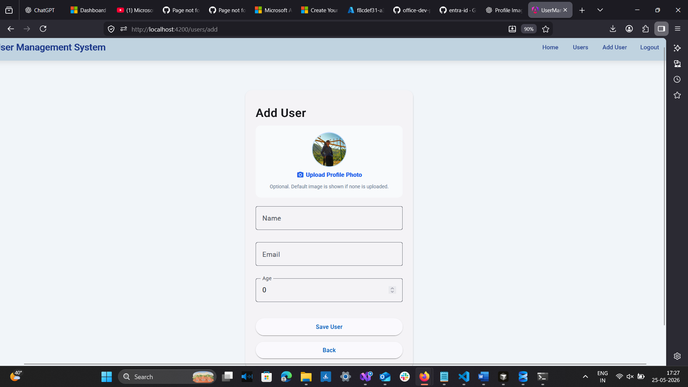
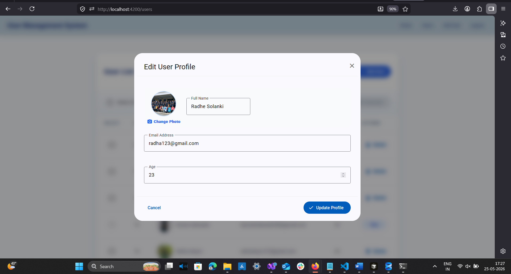
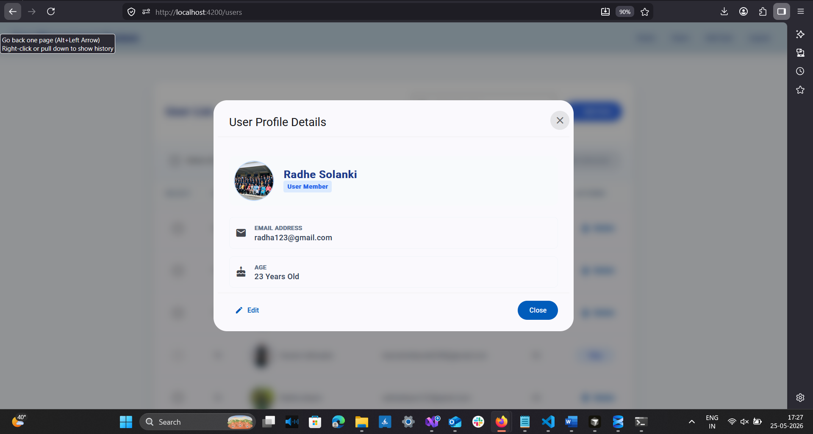

# UserManagementAPI

A full-stack user management system built with ASP.NET Core Web API and Angular. This solution provides secure user registration, login, authenticated user management, and profile image upload.

## Project Structure

- `UserManagementAPI.csproj` — ASP.NET Core Web API project targeting .NET 8.
- `Program.cs` — app startup and middleware configuration.
- `Controllers/` — API controllers for authentication and user management.
- `Data/` — EF Core database context and migrations.
- `Models/` — data and request/response models.
- `Services/` — JWT token handling, current user context, and profile image management.
- `uploads/profile/` — file storage for uploaded user profile images.
- `user-management-ui/` — Angular frontend application.

## Key Features

- JWT-based authentication and authorization
- Secure registration and login endpoints
- Protected user management routes for authenticated clients
- User profile details and editable profile data
- Profile image upload with file validation
- SQL Server / LocalDB persistence with Entity Framework Core
- Swagger API documentation in development mode

## Technology Stack

- Backend: ASP.NET Core 8, Entity Framework Core, SQL Server
- Authentication: JWT Bearer tokens
- Frontend: Angular 21, Angular Material

## Configuration

The API uses `appsettings.json` for configuration values.

### Important settings

- `ConnectionStrings:DefaultConnection` — SQL Server connection string
- `Jwt:Key` — secret key used to sign JWT tokens
- `Jwt:Issuer` — JWT issuer value
- `Jwt:Audience` — JWT audience value

Example from `appsettings.json`:

```json
{
  "ConnectionStrings": {
    "DefaultConnection": "Server=(localdb)\\MSSQLLocalDB;Database=UserManagementDb;Trusted_Connection=True;TrustServerCertificate=True;"
  },
  "Jwt": {
    "Key": "THIS_IS_MY_SUPER_SECRET_KEY_12345",
    "Issuer": "UserManagementAPI",
    "Audience": "UserManagementClient"
  }
}
```

## Running the Application

### Prerequisites

- .NET 8 SDK
- Node.js and npm
- SQL Server / LocalDB

### Backend

1. Open a terminal in the repository root.
2. Apply database migrations:

```bash
dotnet ef database update
```

3. Run the API:

```bash
dotnet run --project UserManagementAPI.csproj
```

The API will typically be available at `https://localhost:5001` or `http://localhost:5000` depending on your launch settings.

### Frontend

1. Open a terminal in `user-management-ui/`.
2. If Angular CLI is installed globally, start the Angular app with:

```bash
gn serve
```

If you prefer using a package manager command, the project already maps `npm start` to `ng serve`.

The frontend will typically be available at `http://localhost:4200/`.

## API Endpoints

### Authentication

- `POST /api/auth/register` — register a new user
- `POST /api/auth/login` — login and receive a JWT token

### User Management (protected)

- `GET /api/users` — list users with paging and optional search
- `GET /api/users/{id}` — get user details by ID
- `POST /api/users` — create a new user
- `PUT /api/users/{id}` — update an existing user
- `POST /api/users/{id}/profile-image` — upload a profile image for a user
- `DELETE /api/users/{id}` — soft delete a user

> Note: All `/api/users` requests require an `Authorization: Bearer <token>` header.

## Authentication Flow

1. The user logs in via `/api/auth/login`.
2. The API returns a JWT token.
3. The Angular client stores the token and sends it on protected requests.
4. The API validates the token and grants access to protected endpoints.

## Uploads

Uploaded images are stored in `uploads/profile/` and served from the static path `/uploads`.

# Screenshots

## User List Main Page



---
## Add User



---
## Edit User Profile



---
## User Profile Detail



## Notes

- Swagger is enabled in development mode for API testing and documentation.
- The backend already protects the `UsersController` with authorization.
- The frontend interceptor attaches the Bearer token automatically to API requests.

## Troubleshooting

- If migrations fail, verify the connection string in `appsettings.json`.
- If JWT authentication fails, confirm the client and server `Jwt:Issuer`, `Jwt:Audience`, and `Jwt:Key` values match.
- Ensure the Angular app and API are running on compatible ports and CORS is configured correctly.

## License

This repository contains project code for a user management system and is intended for learning and internal use.
